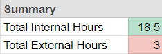

# Honors-Volunteering-Records-Manager
The main Google Sheet tracks my volunteering hours for the NJIT Honors College, but the Apps Scripts part help calculate the hours and generate a semester summary, so I can quickly see if I meet the requirements of each semester. 

The following screenshot is an image of the data I have (as of 10/22/2024). The "Hours" column is automatically calulated based on the "Start Time" and "End Time.":

This is the summary based on the data above (if the "Type" is Internal, then it counts for total Internal hours - and the same for External):

I might add other features (like which organization I volunteered the most for, or a global summary of all of my semesters) depending on necesity and time.

Thank you!
